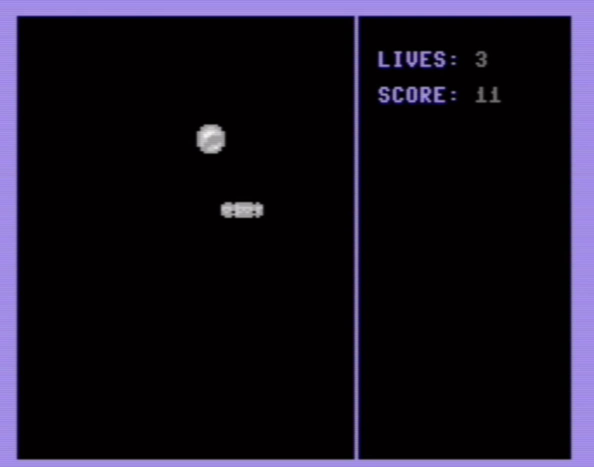
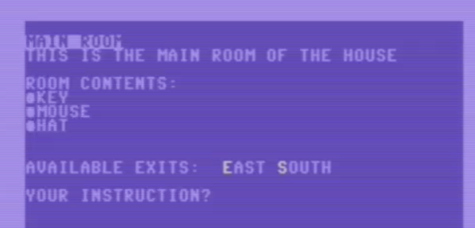

# Commdore C64 programming [tutorial](https://retrogamecoders.com) and **XC=Basic** C64 Text Adventure engine

## bat and ball sprite game demo

* batball.bas basic code
* batball.prg compiled prg
* bat.bin bat sprite
* ball.bin ball sprite

## c64 text adventure game engine

* c64-text-adventure.prg is the currently compiled game
* c64-text-adventure.bas is the XC=Basic code as it currently stands

You can try this demo in your web browser here:
https://retrogamecoders.com/c64-emulator/?disk=c64-text-adventure.prg&nocache

## Also
* bits.bas is a library to help work with bits of bytes :)
* load pic is a demo of compiling external binary data into the prg (in this case a bitmap)
